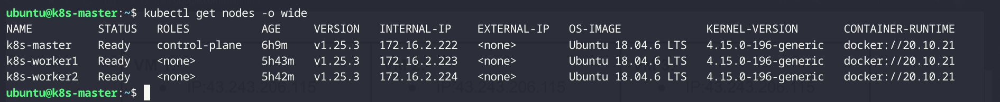
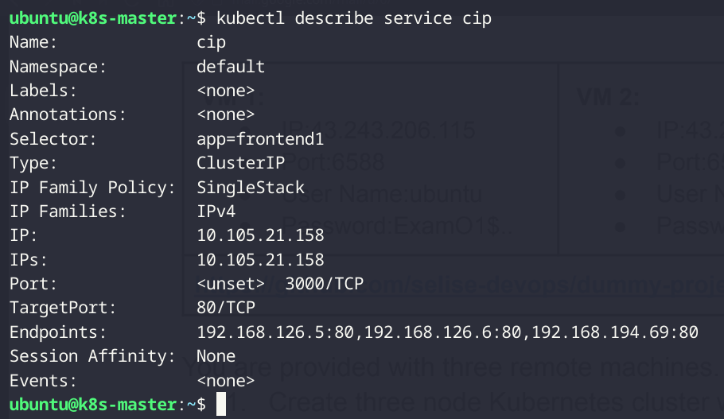
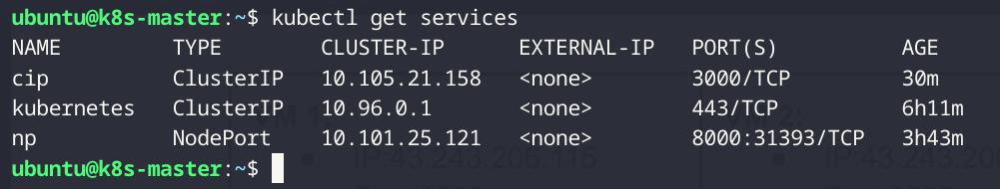
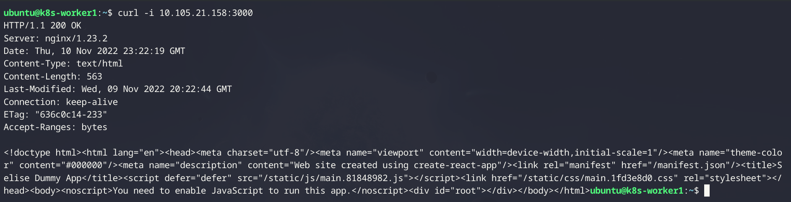
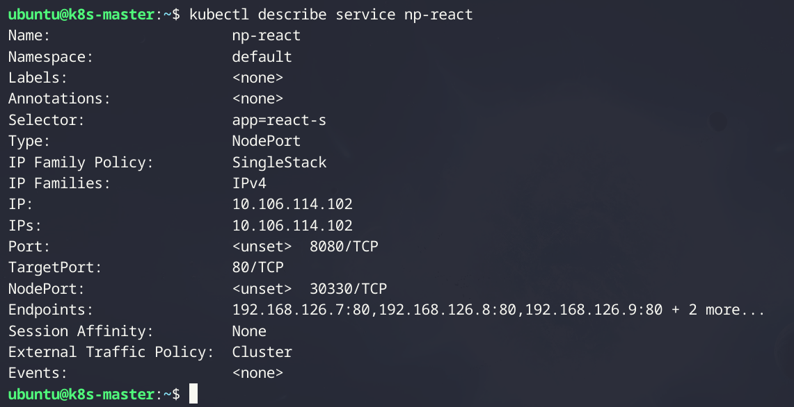
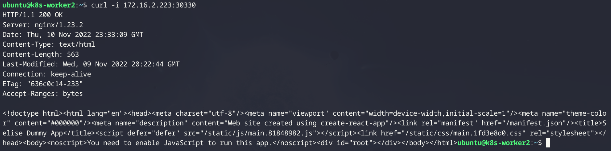
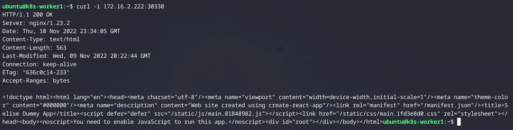

# Creating Cluster


For using Docker as Container Runtime, Mirantis [cri-dockerd](https://github.com/Mirantis/cri-dockerd) was installed and configured. 

# Publishing Images to Docker Hub using GitHub Actions
Two branches of the repository **main** and **dev** will build docker image and publish the image in my docker hub repository [sudipto003/dummy-react](https://hub.docker.com/repository/docker/sudipto003/dummy-react) with different tags.

*prod-img-build* workflow in main brach triggers on push on main brach and then sequence of jobs executing checkout content, login docker hub, extract metadata and build and push to docker hub.

```
on: 
    push:
        branches:
        - "main"
```

Login to docker hub, *docker/login-action@v2* used with username and passwords stored as repository secrets.

```
with:
    username: ${{ secrets.DOCKER_USERNAME }}
    password: ${{ secrets.DOCKER_PASSWORD }}
```

For extracting the tag for the image, used action *docker/metadata-action@v4*

```
with:
    tags: |
        type=raw,value=production
        type=raw,value=stable
```
Used two tags **production** and **stable** for the image from main branch with type raw and string value for extracting.

In last job used docker/build-push-action@v3, build the image from Dockerfile and push to docker hub with tags extracted in earlier *meta* job.

```
with:
    context: .
    push: true
    tags: ${{ steps.meta.outputs.tags }}
```

A similar *build-dev-image* workflow in dev branch build and push docker image from the content of that branch.
For dev image, tag with the branch name was defined with type ref and event branch and another tag with raw backup value.

```
with:
    tags: |
        type=ref,event=branch
        type=raw,value=backup
```

# Services
## Cluster IP
Demonstrated a custer IP service with a deployment of the demo-project:production image with 5 replicaset. Manifest for the Deployment and Service.

```
apiVersion: apps/v1
kind: Deployment
metadata:
  name: frontend
spec:
  replicas: 3
  selector:
    matchLabels:
      app: frontend1
  template:
    metadata:
      labels:
        app: frontend1
    spec:
      containers:
      - name: react1
        image: sudipto003/dummy-react:production
        ports:
        - containerPort: 80


apiVersion: v1
kind: Service
metadata:
  name: cip
spec:
  selector:
    app: frontend1
  ports:
  - protocol: TCP
    port: 3000
    targetPort: 80
```

The Containers in the Pod listens at port 80 defined in *spec.template.spec.containers[\*].containerPort* and default service maps port 3000 to the pods container port 80 and expose the deployment. Service selects the containers by *spec.selector*, so every container with a label *app: frontend1* is selected for this service. Every service is assigned with a Cluster IP and can be accessed by <clusterIP>:<port>.

` kubectl describe service cip `



` kubectl get services `



*cip* service assigned with Cluster IP 10.105.21.58 and maps port 3000 to the containers. So cip service can be accessed by ***10.105.21.58:3000*** from within the cluster.

` curl -i 10.105.21.58:3000 `


## NodePort
NodePort Service to expose an application with containers label *app: react-s*.

```
apiVersion: v1
kind: Service
metadata:
  name: np-react
spec:
  type: NodePort
  selector:
    app: react-s
  ports:
  - protocol: TCP
    port: 8080
    targetPort: 80
```
Kubernetes assigned NodePort for the service if not specified.

` kubectl describe service np-react `


Port 30330 accepts request on each node and then forward the request to port 8080 inside the cluster and then it forwards to target port 80 in container pod. So requesting on nodeIP:30330 grant access to the service. All three service endpoints, 
***172.16.2.222:30330***
***172.16.2.223:30330***
***172.16.2.224:30330***

` curl -i 172.16.2.222:30330 `


` curl -i 172.16.2.223:30330 `


## LoadBalancer

# demo-project
> node v14.21.1,
> npm 8.19.3
